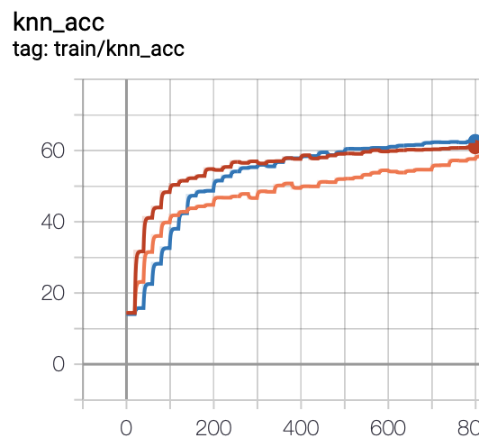

# CL-Baselines
This is a Pytorch implementation of contrastive Learning(CL) baselines. 

You can 
1) run recent CL baselines on multi-scale datasets(CIFAR10/100, ImageNet-100, ImageNet, COCO).
2) easily modify the various baselines for your research/project.


# Preparation
1) Install conda 
2) Make conda environment & activate it
```
conda env create -f cl_env.yaml
conda activate cl_env
```


# Results 
Experimented on CIFAR100 with Resnet-18

## Knn-acc
|          | SimCLR |  MoCo v2 | SimSiam |
|:--------:|:------:|:-----:|:-------:|
| Knn Acc. |  59.72 | 60.61 |  62.64  |

## Training Curve


# Training
## SimCLR
### CIFAR 
```
python main_train.py \
    --method simclr --arch resnet18 \
    --dataset cifar100 --batch_size 512 --eval_batch_size 512 --num_workers 8 \
    --epochs 1000 --knn_eval_freq 20 --lr 0.5 --wd 1e-4 --temp 0.5 \
    --dist-url 'tcp://localhost:10001' --multiprocessing-distributed --world-size 1 --rank 0 \
    --trial 0 
```
### ImageNet-100 
```
python main_train.py \
    --method simclr --arch resnet50 \
    --dataset ImageNet-100 --batch_size 256 --eval_batch_size 512 --num_workers 8 \
    --data_path [your imagenet-folder] \  
    --epochs 200 --knn_eval_freq 20 --lr 0.5 --wd 1e-4 --temp 0.5 \
    --dist-url 'tcp://localhost:10001' --multiprocessing-distributed --world-size 1 --rank 0 \
    --trial 0 
```

## MoCo v2
### CIFAR 
```
python main_train.py \
    --method moco --arch resnet18 \
    --dataset cifar100 --batch_size 512 --eval_batch_size 512 --num_workers 8 \
    --epochs 800 --knn_eval_freq 20 --lr 0.06 --wd 5e-4 --temp 0.1\
    --moco-k 4096 --moco-m 0.99 \
    --dist-url 'tcp://localhost:10001' --multiprocessing-distributed --world-size 1 --rank 0 \
    --trial 0  
```
### ImageNet-100 
```
python main_train.py \
    --method moco --arch resnet50 \
    --dataset ImageNet-100 --batch_size 256 --eval_batch_size 512 --num_workers 8 \
    --data_path [your imagenet-folder] \  
    --epochs 200 --knn_eval_freq 20 --lr 0.06 --wd 1e-4 --temp 0.1\
    --moco-k 16128 --moco-m 0.999 \
    --dist-url 'tcp://localhost:10001' --multiprocessing-distributed --world-size 1 --rank 0 \
    --trial 0  
```

## SimSiam
### CIFAR 
```
python main_train.py \
    --method simsiam --arch resnet18 \
    --dataset cifar100 --batch_size 512 --eval_batch_size 512 --num_workers 8 \
    --epochs 800 --knn_eval_freq 20 --lr 0.06 --wd 5e-4 \
    --dist-url 'tcp://localhost:10001' --multiprocessing-distributed --world-size 1 --rank 0 \
    --trial 0
```
### ImageNet-100 
```
python main_train.py \
    --method simsiam --arch resnet50 \
    --dataset Imagenet-100 --batch_size 256 --eval_batch_size 512 --num_workers 8 \
    --data_path [your imagenet-folder] \ 
    --epochs 800 --knn_eval_freq 20 --lr 0.06 --wd 1e-4 \
    --dist-url 'tcp://localhost:10001' --multiprocessing-distributed --world-size 1 --rank 0 \
    --trial 0
```

# Knn Evaluation 
```
python main_knn_eval.py --method simclr --arch resnet18 --dataset cifar100 \
--saved_path ../CL_logs/cifar100-simclr_resnet18-None-0
```

# References
(1) SimCLR: https://github.com/HobbitLong/SupContrast \
(2) MoCo: https://github.com/facebookresearch/moco \
(3) SimSiam: https://github.com/facebookresearch/simsiam \
